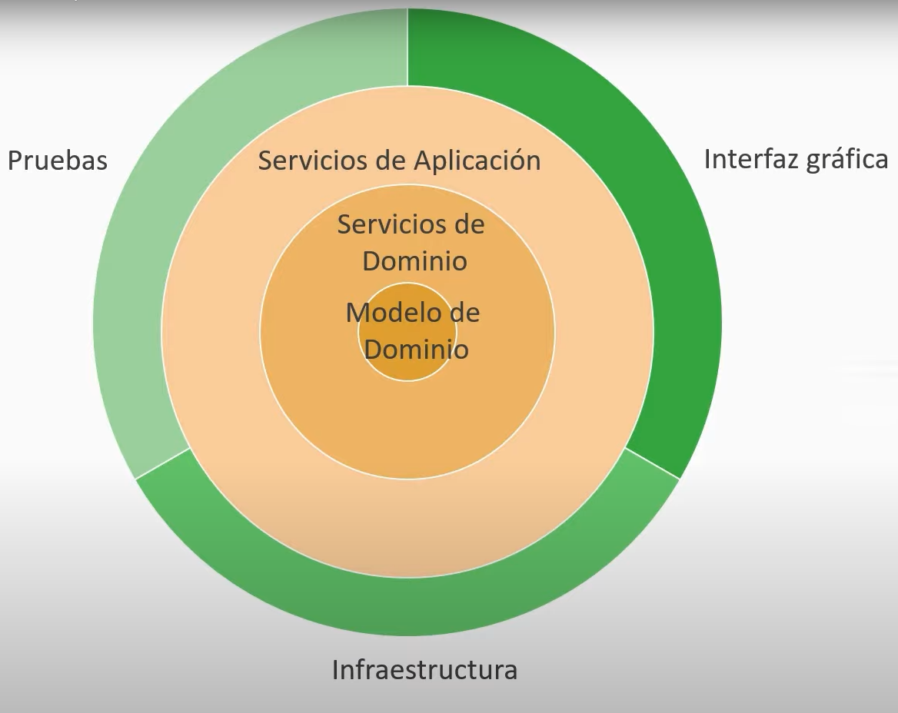
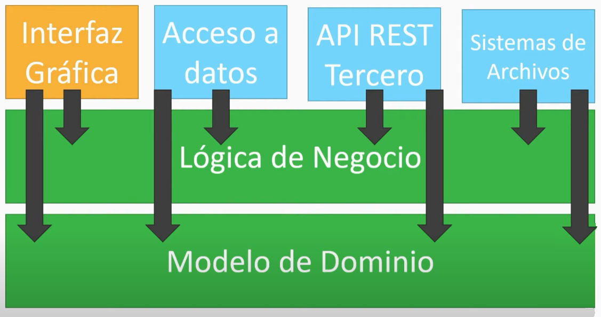

# Onion Architecture

[Back to home](./../../../)

Propuesta de organización del código para mantener separada la lógica de negocios de otros elementos que eventualmente podrían cambiar.

Consta de 2 capas principales, el núcleo que contiene la lógica de negocio y luego una capa externa con elementos cambiantes, la aplicación no gira en torno a estos elementos.

## Capas

### Núcleo

Está formado a su vez por 3 capas:

#### Modelo de dominio | Capa de dominio | Entidades de dominio

Acá se almacenan las entidades aisladas.

Solo depende de si mismo.

#### Servicios de dominio | Servicios de objetos | Capa de repositorio

Se definen las interfaces de persistencia para obtener y guardar datos.

#### Servicios de aplicación | Capa de servicios

Lógica de negocio, operaciones.

### Capa externa

Se divide en 3 partes pero no como cebolla, es como un gráfico de torta.

Las partes de esta capa son cambiantes.

#### Interfaz gráfica

#### Pruebas

#### Infraestructura

- Bases de datos
- Sistema de archivos
- Servicios web

## Reglas

### Principio de inversión de dependencias

Las dependencias van de afuera hacia adentro.

A nivel de código se trabaja con interfaces e inyección de dependencias.

## Diferencia con arquitectura hexagonal

En la arquitectura hexagonal los puertos y adaptadores definen como será la integración con el núecleo de la aplicación, en la arquitectura onion esto queda más libre.

## Estructura (ejemplo)

Dentro de la carpeta `app` hay una estructura de ejemplo donde se pueden ver las 2 capas principales (Core y External) y luego a partir de allí los diferentes módulos:

- `Core`: Capas del núcleo de la aplicación.
  - `DomainModel`: Entidades de dominio.
  - `DomainServices`: Definición de las interfaces para los repositorios.
  - `ApplicationService`: Lógica de negocio usando los servicios de dominio (interfaces).
- `External`: Capas externas de la aplicación o "porciones" del gráfico de torta.
  - `GUI`: Interfaz gráfica de usuario. Tiene controllers para gestionar las aplicaciones y vistas para presentar la información.
  - `Infrastructure`:
    - `Repositories`: Implementación concreta de los repositorios definidos en los servicios del dominio.
    - `Database`: Configuración de la base de datos y scrips de migración.
    - `FileSystem`: Servicios para interactuar con el sistema de archivos.
    - `WebServices`: Servicios para consumo de servicios web externos.
  - `Tests`: Directorio para almacenar las pruebas.
