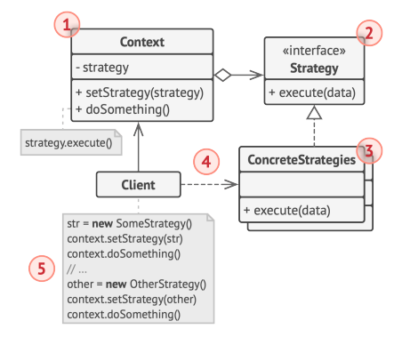

# Strategy (or Policy)

[Back to home](./../../../../)

## Definition

It is a behavioral design pattern that suggests a way to choose at runtime from a set of algorithms.

It is based on composition rather than inheritance.

### Components

#### Context

It is the class that delegates its behavior to a strategy. It should internally store a reference to the selected strategy.

The context class is not responsible for selecting the strategy to apply; the client does that. The context class shouldn't even know the selected strategy; it invokes the corresponding method through a generic interface.

#### Strategy Interface

Defines the behavior for all strategies that implement it.

#### Concrete Strategies

Classes that implement the strategy interface.

## Use Cases

- There are different algorithms to choose from at runtime.
- There are several similar classes that differ in how they execute certain behavior.
- There are large conditional structures to define algorithm variants to be used based on cases.

### Examples of Application

- Sorting algorithms. Different sorting strategies can be applied to the object to be sorted.
- Validation rules applied to the object to be validated.
- Text formatting applied to the object to be formatted.
- Database access. Different strategies can be used for different engines, changing based on a configuration file.
- Payment methods and selection based on the choice made during the checkout of an e-commerce.
