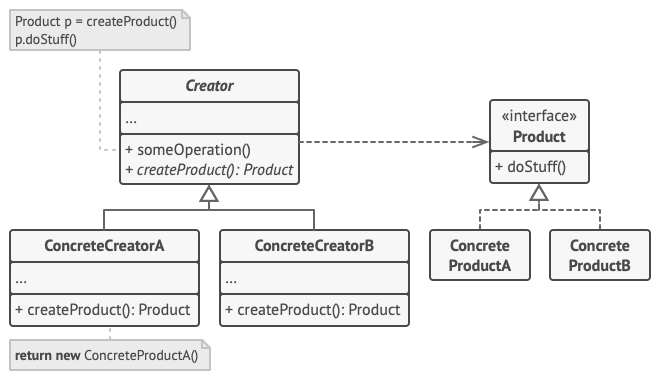

# Factory

[Back to home](./../../../../)

## Definition

It is a creational design pattern that provides an interface for creating objects in a base class, letting each subclass define the type of object that will be created.

It separates the construction of an object type from the logic of using that object.

### Components

#### Creator Class

Contains the method that allows creation.

## Use Cases

- When there is uncertainty about the exact types with which the software will work.
- When you want to leave open the possibility of extending or incorporating new types of objects or components (open/close SOLID).
