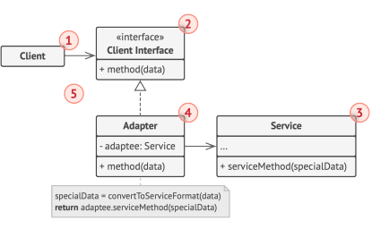

# Adapter

[Back to home](./../../../../)

## Definition

It is a structural design pattern that provides compatibility between objects that are not initially compatible.

It converts the interface of a class into another that the client expects.

> **Difference with Facade**
>
> It can change and extend the system's functionality.
>
> It adapts it to the form that the client expects.

### Components

#### Client

Business logic.

#### Interface

Specifies the methods with which the client interacts.

#### Service (Adaptee)

Incompatible class or one that needs to be adapted. The client cannot use this directly.

#### Adapter

Implements the interface that the client uses and, in turn, wraps the incompatible service in this interface.

It acts as a kind of translator or intermediary between the client and the service.

## Use Cases

- There is an existing class that must be used (legacy or 3rd party) that is not compatible with the application.
- It is required to add some functionality to one of these classes, so, in addition to the provided interface, it adds its own methods.
