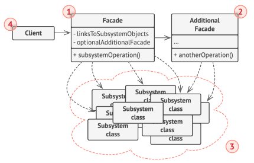

# Facade

[Back to home](./../../../../README.md)

## Definition

It is a structural design pattern that acts as an interface for a complex system.

It serves, for example, to expose only certain methods of the system or to simplify its use by handling certain configurations or tasks.

> **Difference with Adapter**
>
> It does not change the functionality of the system, it simplifies it.

### Components

#### Facade

Class that exposes the methods and will be used.

More than one facade can be created depending on how you want to structure the solution or on the complexity of the underlying system.

#### Complex Subsystem

It will be the own or external class that you want to simplify.

## Use Cases

- Simplify the interface of a complex system (APIs, libraries) by exposing fewer methods or making its use easier.
- It is usually implemented in the application layer.

### Examples of Application
